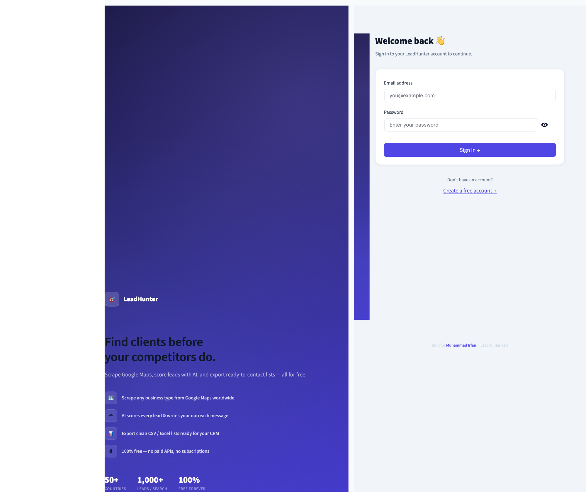
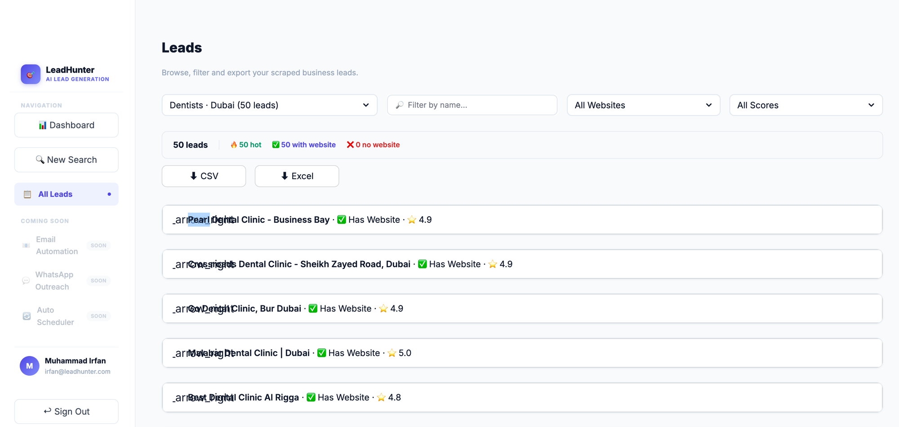

# 🎯 LeadHunter — AI Google Maps Lead Generation

**Built for Muhammad Irfan**

[](https://rka8vsksqwtxscyx2hmhee.streamlit.app/)

> Scrape Google Maps, score every lead with AI, and export ready-to-contact CSV/Excel lists — **100% free, no paid APIs.**

🔗 **Live Demo:** [https://rka8vsksqwtxscyx2hmhee.streamlit.app/](https://rka8vsksqwtxscyx2hmhee.streamlit.app/)

**Login:** `irfan@leadhunter.com` / `irfan123`

---

## Screenshots

### Login


### Leads Page


---

## Features

| Feature | Description |
|---------|-------------|
| 🗺️ Google Maps Scraper | Scrape any business type in any city worldwide |
| 🤖 AI Lead Scoring | Ollama (Mistral) scores every lead 0–100 with notes |
| 📊 Dashboard | KPI cards, recent searches, lead quality breakdown |
| 📋 Lead Management | Filter by score, website, name — with expandable cards |
| ⬇️ Export | One-click CSV and Excel export |
| 🔒 Auth | Register / login with bcrypt-hashed passwords |

---

## Tech Stack

| Layer | Tech |
|-------|------|
| Frontend | Streamlit 1.57 |
| Database | SQLite + SQLAlchemy |
| Scraper | Playwright (headless Chromium) |
| AI Scoring | Ollama (Mistral) — fallback scorer if offline |
| Auth | bcrypt |
| Deploy | Streamlit Cloud |

---

## Run Locally

```bash
# 1. Clone
git clone https://github.com/IrfanGoraya442/Leads.git
cd Leads

# 2. Create virtual environment
python -m venv venv
source venv/bin/activate      # Windows: venv\Scripts\activate

# 3. Install dependencies
pip install -r requirements.txt
playwright install chromium

# 4. (Optional) Start Ollama for AI scoring
# https://ollama.com/download
ollama pull mistral

# 5. Run
streamlit run app.py
```

Open [http://localhost:8501](http://localhost:8501)

---

## Project Structure

```
ai-lead-hunter/
├── app.py                  # Login / Register page
├── database.py             # SQLite models (User, Search, Lead)
├── requirements.txt
├── packages.txt            # System deps for Streamlit Cloud
├── pages/
│   ├── 1_Dashboard.py      # KPI cards + recent searches
│   ├── 2_Search.py         # Search form + scrape runner
│   └── 3_Leads.py          # Lead browser + export
├── services/
│   ├── scraper/
│   │   └── maps_scraper.py # Playwright Google Maps scraper
│   └── ai/
│       └── lead_analyzer.py# Ollama AI scoring + fallback
├── utils/
│   ├── auth.py             # bcrypt login / register
│   ├── styles.py           # Sidebar, KPI cards, CSS
│   └── export.py           # CSV / Excel export
└── screenshots/
    ├── login.png
    └── leads.png
```

---

## Default Credentials (Streamlit Cloud)

| Field | Value |
|-------|-------|
| Email | `irfan@leadhunter.com` |
| Password | `irfan123` |

> Note: The cloud database resets on each redeploy. The default account is auto-created on startup.
